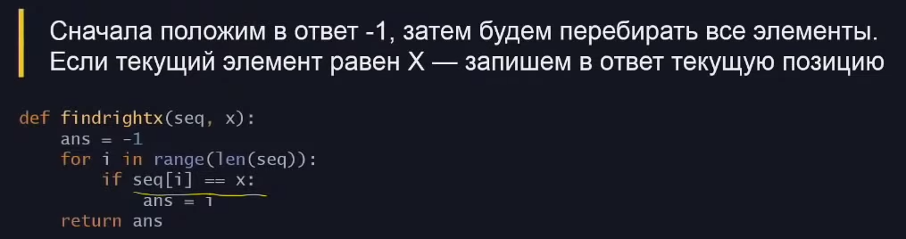
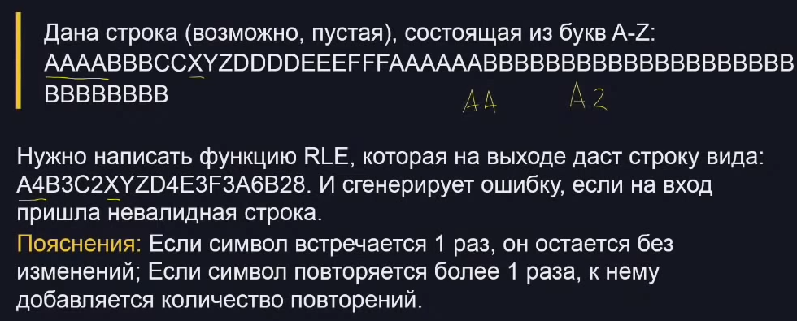

# Лекция 2. Линейный поиск

Линейный поиск - перебор всех элементов последовательности

Сложность такого поиска О(n)

## Алгоритм для одного прохода

Задача 1

Задача 2 

Задача 3

Дана последовательность длиной Н, найти максимальное число

Копирование объектов занимает время, правда в питоне это все равно О(1) потому что в нем все ссылка. Но в других языках, перемещается целый обьект. Поэтому можно оперировать только  индексами обьектов из последовательности. Хотя скорее всего такой подход будет дольше. Тогда получится так:

Задача 4

Вот тут надо понимать формулировку задачи. Потому что если в такой последовательности 3 2 1 3 убрать первую 3 то останется 2 1 3. И вторым максимумом будет тоже 3

 

**Хинт**: если надо экономить время, то цикл надо начинать не с начала а с третьего элемента последовательности

Задача 5

Более универсальный вариант это добавить влаг, который будет изначально False, а как только встретится первое число подходящее под условие он станет True. Если так не сделать, то при условии что надо найти нечетное число использовать -1 будет нельзя 

## Алгоритм двупроходный

Идея с двойным проходом последовательности в том, что это будет бсытрее чем пройти один раз и в моменте прохода что то запонимать

Задача 6

Долгое решение потому что используется сложение строк. В питоне строка неизменяемый тип данных, поэтому при сложении двух строк создается 3 строка. Это долго. Можно этого избежать путем добавления в список. Это будет занимать время О(1). Исправленный вариант:

Задача 7

Сначала не ясно как это решать. Надо брать кубики воды и двигать их направо или налево, если есть преграда, то кубики остаются. . . Можно взять и все столбики преобразовать в числа, описывающие их высоту. Таким образом, последовательность острова 3 1 4 3 5 1 1 3 1. И поставить условие, если вода попала между двумя более высокими столбиками земли, то она остается, если нет, выливается. Предварительно надо найти максимум острова.

## Задача с собеса RLE

Вроде задача сложная. Поэтому разобьем её на более простые и для начала попытаемся упрощать строки типа AABBBCA в ABCA. Запоминаем последний символ, есть список в который будет ответом. Если новый символ не равен последнему, то последний добавляем в ответ и обновляем на текущий. Вот так:

Для RLE надо еще подсчитывать кол-во одинаковых символов. Это можно сделать тоже через смену последнего символа, запоминать позиции и через вычитание понять сколько было одинаковых

- Написание continue и break это скорее плохая практика, не стоит их использовать, потому что сложно читать такой код
- 